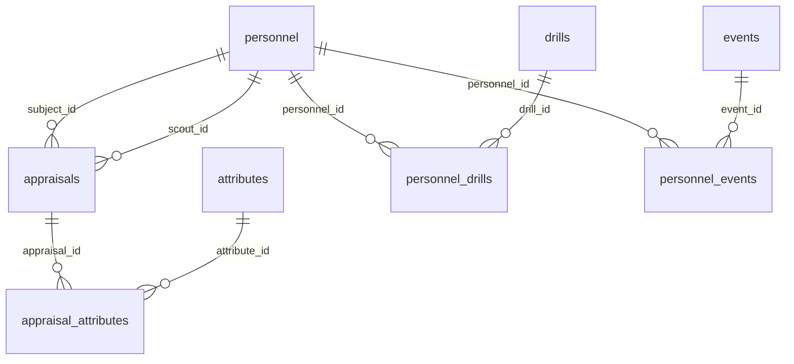

# Goal Post Pro – Database Schema

Goal Post Pro is an athletics data gathering, storing and processing system for sporting organizations. This document describes the database it uses, for reference by any project or agent that works with the same database.

- **Engine:** MySQL
- **Database name:** `goalpostpro`
- **Conventions:** every table has `id INT AUTO_INCREMENT PRIMARY KEY` and `created_at TIMESTAMP DEFAULT CURRENT_TIMESTAMP`. All data lives in the database; nothing is hardcoded or held in memory.

> **Note:** No foreign key constraints are declared. Relationships below are *logical* (by column-name convention) and are not enforced by the database. Application code is responsible for keeping references valid.

## Entity relationship overview

`users`, `countries` and `continents` are standalone tables with no relationships to the others.

## Tables

### `users`
Application accounts.

| Column | Type | Constraints |
|---|---|---|
| id | INT | PK, auto-increment |
| name | VARCHAR(255) | |
| email | VARCHAR(255) | |
| password | VARCHAR(255) | Should store a password hash, never plaintext |
| created_at | TIMESTAMP | default `CURRENT_TIMESTAMP` |

### `personnel`
Athletes, administrators and support staff belonging to an organization.

| Column | Type | Constraints |
|---|---|---|
| id | INT | PK, auto-increment |
| first_name | VARCHAR(255) | NOT NULL |
| last_name | VARCHAR(255) | NOT NULL |
| email | VARCHAR(255) | |
| phone | VARCHAR(255) | |
| personnel_type | ENUM('athlete','admin','support') | NOT NULL |
| height | INT | |
| weight | INT | |
| date_of_birth | DATE | |
| age | INT | |
| joined_at | TIMESTAMP | |
| created_at | TIMESTAMP | default `CURRENT_TIMESTAMP` |

### `attributes`
Definitions of the qualities a scout can score in an appraisal (e.g. "Speed").

| Column | Type | Constraints |
|---|---|---|
| id | INT | PK, auto-increment |
| name | VARCHAR(255) | NOT NULL |
| short_name | VARCHAR(255) | |
| created_at | TIMESTAMP | default `CURRENT_TIMESTAMP` |

### `appraisals`
A single scouting appraisal of one person by another.

| Column | Type | Constraints | Logical reference |
|---|---|---|---|
| id | INT | PK, auto-increment | |
| scout_id | INT | NOT NULL | `personnel.id` (the appraiser) |
| subject_id | INT | NOT NULL | `personnel.id` (the person appraised) |
| created_at | TIMESTAMP | default `CURRENT_TIMESTAMP` | |

### `appraisal_attributes`
Join table: the score given for each attribute within an appraisal.

| Column | Type | Constraints | Logical reference |
|---|---|---|---|
| id | INT | PK, auto-increment | |
| attribute_id | INT | NOT NULL | `attributes.id` |
| appraisal_id | INT | NOT NULL | `appraisals.id` |
| score | INT | NOT NULL | |
| created_at | TIMESTAMP | default `CURRENT_TIMESTAMP` | |

### `drills`
Definitions of drills / tests (e.g. "40m sprint").

| Column | Type | Constraints |
|---|---|---|
| id | INT | PK, auto-increment |
| name | VARCHAR(255) | NOT NULL |
| created_at | TIMESTAMP | default `CURRENT_TIMESTAMP` |

### `personnel_drills`
Join table: a person's result in a drill on a given date.

| Column | Type | Constraints | Logical reference |
|---|---|---|---|
| id | INT | PK, auto-increment | |
| drill_id | INT | NOT NULL | `drills.id` |
| personnel_id | INT | NOT NULL | `personnel.id` |
| score | INT | NOT NULL | |
| date | DATE | | |
| created_at | TIMESTAMP | default `CURRENT_TIMESTAMP` | |

### `events`
Definitions of events (e.g. matches, trials, camps).

| Column | Type | Constraints |
|---|---|---|
| id | INT | PK, auto-increment |
| name | VARCHAR(255) | NOT NULL |
| created_at | TIMESTAMP | default `CURRENT_TIMESTAMP` |

### `personnel_events`
Join table: a person's participation in an event on a given date.

| Column | Type | Constraints | Logical reference |
|---|---|---|---|
| id | INT | PK, auto-increment | |
| event_id | INT | NOT NULL | `events.id` |
| personnel_id | INT | NOT NULL | `personnel.id` |
| date | DATE | | |
| created_at | TIMESTAMP | default `CURRENT_TIMESTAMP` | |

### `countries`
Reference data for countries.

| Column | Type | Constraints |
|---|---|---|
| id | INT | PK, auto-increment |
| name | VARCHAR(255) | NOT NULL |
| iso2 | VARCHAR(255) | |
| iso3 | VARCHAR(255) | |
| local_name | VARCHAR(225) | |
| created_at | TIMESTAMP | default `CURRENT_TIMESTAMP` |

### `continents`
Reference data for continents.

| Column | Type | Constraints |
|---|---|---|
| id | INT | PK, auto-increment |
| name | VARCHAR(255) | NOT NULL |
| code | VARCHAR(255) | |
| created_at | TIMESTAMP | default `CURRENT_TIMESTAMP` |

## Schema notes

- **No foreign keys or indexes** beyond primary keys. Deleting a `personnel`, `drills`, `attributes` or `appraisals` row leaves orphaned rows in the tables that reference it unless the application removes them first.
- **`personnel.age`** duplicates information derivable from `date_of_birth` and can go stale; prefer computing age from `date_of_birth`.
- **`personnel` has no link to `countries`/`continents`** (or to an organization), so multi-organization use and location data are not modelled.
- **Units and scales** are not defined in the schema: units for `personnel.height`/`weight`, and the meaning/scale of `score` in `appraisal_attributes` and `personnel_drills`.
